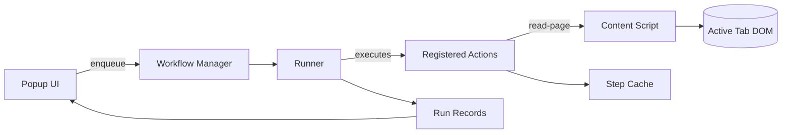

# Auto Boring Architecture Notes

## Overview
- Browser extension built with Plasmo (Manifest V3) and React popup UI.
- Automation layer defines reusable actions executed by the workflow manager.
- Actions can consume cached state, user input, and page context passed in by the runner.

## System Diagram

## Automation Pipeline
- `workflow-manager` queues task runs to avoid concurrent execution conflicts.
- Each workflow task describes ordered steps mapped to registered actions in `lib/automation/actions`.
- Actions receive the step config, shared context, and a cache for passing data between steps.
- `runner` executes steps sequentially, persisting outputs and propagating errors to the UI.

## Content Extraction Flow
- `read-page` action queries the active tab and requests `contents/read-page` for structured data.
- Content script selects a meaningful container, prunes noise (`script`, `style`, etc.), and normalizes text.
- Extraction helpers in `lib/automation/extraction` separate responsibilities for selection lookup, cloning, pruning, and text collection.
- Fallbacks: workflow context page content, action-level fallback strings, or sanitized HTML ensure a result when live scraping fails.

## Debug Mode
- Debug utilities live in `lib/debug` and gate trace logging behind a toggle.
- Launch dev mode with tracing via `pnpm run dev:debug` (sets `PLASMO_PUBLIC_AUTOMATION_DEBUG=true`).
- Or toggle dynamically by running `window.__AUTO_BORING_DEBUG__ = true` in the popup DevTools console; assign `false` to disable at runtime.
- When enabled, `read-page` collects step traces in action metadata and logs scoped console messages to aid troubleshooting.

## Implemented Features
- Popup quick actions to trigger workflows and show latest run metadata.
- `read-page`, `summarize-text`, and `structured-prompt` actions with configurable behavior.
- Workflow management with cancellation, sequential execution, and Vitest coverage for core flows.
- Content sanitization helpers (`normalizeExtractedText`, `sanitizeHtmlFragment`, formatters) to produce prompt-friendly text.

## Testing & Verification
- `pnpm test` runs the Vitest suite covering workflow orchestration and action fallbacks.
- `pnpm build` validates the Plasmo build pipeline and outputs the MV3 bundles under `build/`.
- For manual verification, run `pnpm dev` (or `pnpm run dev:debug`) and use the popup to trigger the "Capture this page" preset against a real tab.
