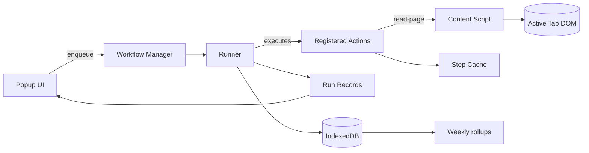

# Auto Boring Architecture Notes

## Overview
- MV3 browser extension powered by Plasmo with a React popup front-end.
- Automation layer exposes composable actions orchestrated by the workflow manager.
- Workflows consume step-level config, shared context, and a cache for passing data between steps.
- Output is persisted to IndexedDB-backed storage and surfaced in the popup + viewer tab.

## System Diagram


## Automation Pipeline
- `lib/automation/workflow-manager` serializes task execution, exposes run state, and supports cancellation.
- `lib/automation/runner` executes each step in order, wiring callbacks (`onStepStart`, etc.) back to the popup.
- Steps reference registered actions in `lib/automation/actions`; the runner shares a Map cache across steps.
- Action metadata fuels the workflow timeline (status, previews, debug crumbs) and viewer diagnostics.

## Key Actions
- **read-page** – Requests `contents/read-page.ts` to clone the DOM, prune noisy nodes, normalize text, and fall back to context or configured strings when needed.
- **structured-prompt** – Renders templates, hits the Chrome Prompt API when available, normalizes JSON (including nested `draftPullRequest` fields), and stashes viewer-ready artifacts.
- **collect-weekly-summary** – Pulls recent daily recaps from storage, formats them into a prompt-ready digest, and reports range metadata.
- **store-artifact** – Persists raw + parsed payloads with metadata/tags so later workflows can retrieve structured results.

## Daily Dev Debrief Schema
```json
{
  "summary": "string",
  "highlights": ["string"],
  "blockers": ["string"],
  "nextFocus": ["string"],
  "actionItems": ["string"],
  "draftPullRequest": {
    "title": "string",
    "content": "string",
    "potentialRegressions": ["string"],
    "blastRadius": "string"
  }
}
```
- Nested fields are auto-trimmed, lists are deduped, and unknown keys are dropped before storage.
- Weekly workflows read these artifacts to synthesize leadership-ready summaries.

## Content Extraction Flow
- `read-page` chooses between live DOM scraping, supplied context (`context.pageContent`), or fallback strings.
- `lib/automation/extraction.ts` centralizes DOM sanitization helpers (`normalizeExtractedText`, `sanitizeHtmlFragment`, `formatExtractedContent`).
- Metadata captured during extraction (title, URL, truncation, debug trace) is bubbled up to the popup for user clarity.

## Debugging
- `lib/debug.ts` provides scoped no-op debuggers that activate when `PLASMO_PUBLIC_AUTOMATION_DEBUG=true` or `window.__AUTO_BORING_DEBUG__` is truthy.
- Debug traces are attached to step metadata and rendered in expandable sections in the workflow timeline.

## Storage & Viewer
- `lib/storage` wraps IndexedDB for artifact persistence, exposing list/filter helpers used by weekly rollups.
- The viewer tab reads stashed artifacts via `lib/viewer.ts`, allowing markdown export and future share targets.
- Step metadata carries `viewerKey` references so the popup can deep-link into the viewer when results are ready.

## Testing & Tooling
- `pnpm test` runs the Vitest suite covering: end-to-end daily workflows, prompt normalization (including PR drafts), storage fallbacks, and queue behaviour.
- `pnpm dev` / `pnpm run dev:debug` compile the popup with hot reload; the latter layers in verbose debug telemetry.
- `pnpm build` produces production bundles under `build/` for packaging or store submission.

## Future Hooks
- Additional actions can register through `registerAction` and become available to presets and the popup with minimal wiring.
- Stashed artifacts already capture metadata for download/export; wiring cloud sync or team sharing would bolt onto the same store.
